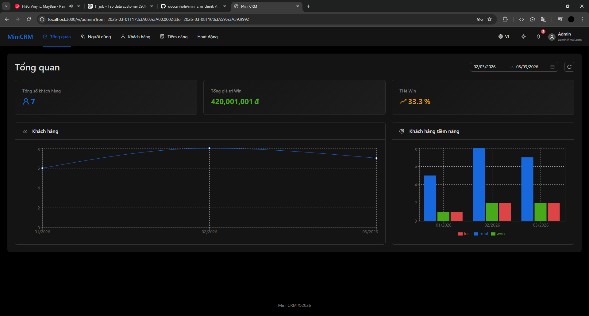
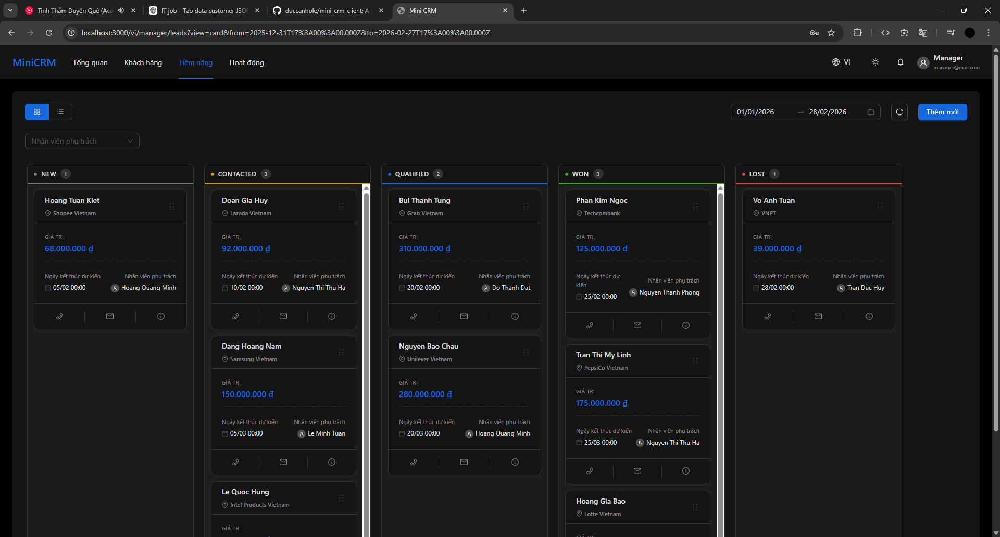
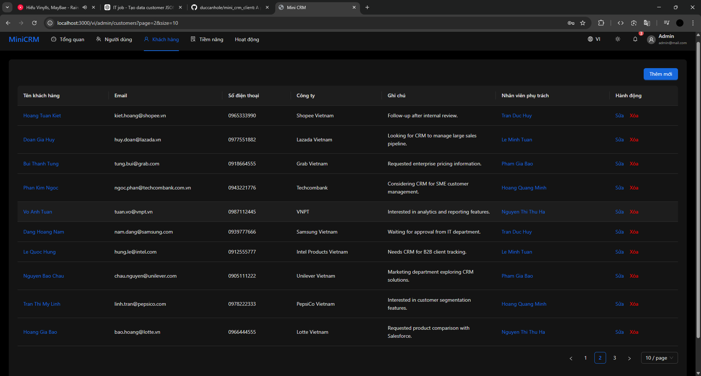
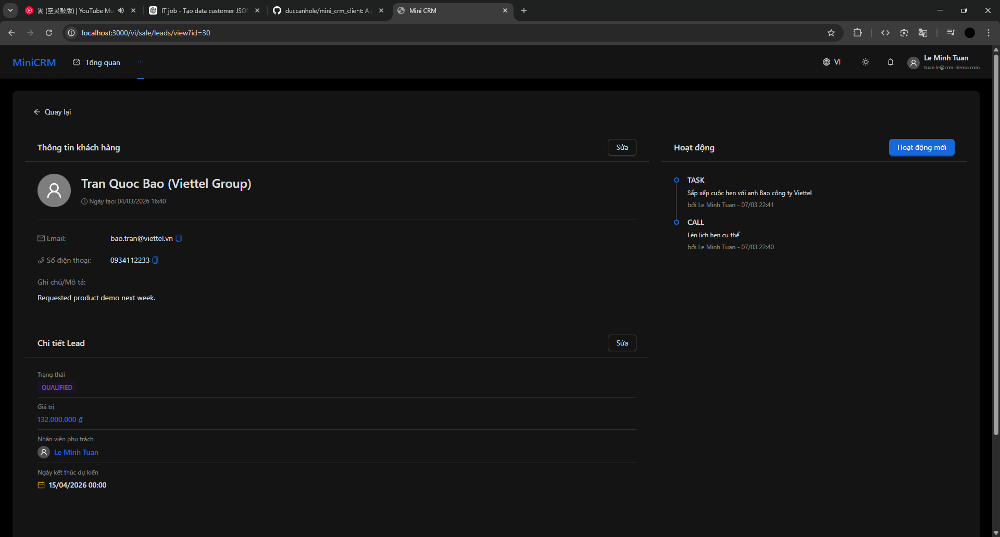
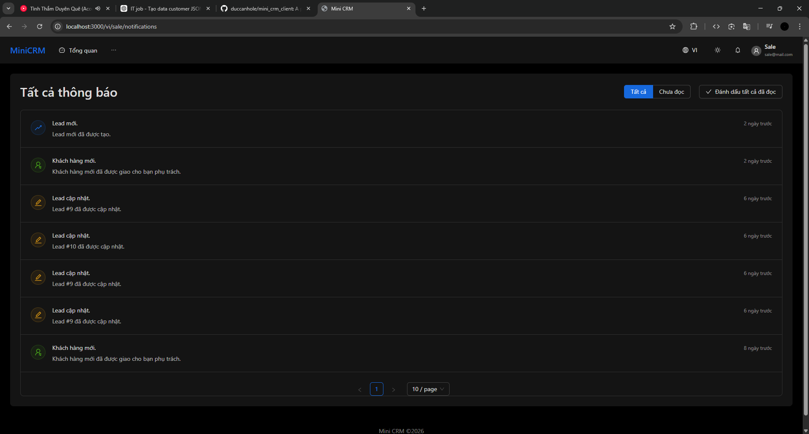

# CRM Client - Enterprise SaaS Frontend

## 🚀 Project Overview

This CRM client is designed as a scalable, maintainable frontend for managing complex business processes. It supports three distinct user roles (Admin, Manager, Sales) with granular permission-based access control, enabling teams to efficiently manage customer relationships, track sales activities, and collaborate in real-time.

The architecture emphasizes **separation of concerns**, **API-driven design**, and **maintainable component hierarchy**—patterns essential for production SaaS applications supporting multiple user types and complex workflows.

## Screenshots

| Dashboard | Leads | Customers | Lead Detail | Notifications |
|----------|-------|-----------|-------------|---------------|
|  |  |  |  |  |

## 🌟 Key Features

### Core Functionality
- **Multi-role Support**: Role-based access control (RBAC) for Admin, Manager, and Sales roles
- **Lead Management**: Pipeline tracking, status updates, value forecasting, and assignment workflows
- **Customer Management**: Comprehensive customer profiles with interaction history and metadata
- **Activity Tracking**: Chronological logging of all customer and lead interactions
- **Real-time Notifications**: Live updates on critical business events and assigned tasks
- **Dashboard Analytics**: Executive overview with revenue forecasts and team metrics

### Architecture Highlights
- **Enterprise Authentication**: JWT-based auth with secure token management and role propagation
- **Centralized API Layer**: Axios with interceptors for consistent request/response handling
- **Query Management**: TanStack React Query for server state synchronization and caching
- **Middleware Pipeline**: Auth + i18n middleware for cross-cutting concerns
- **Type Safety**: Full TypeScript implementation with strict compiler settings
- **Internationalization**: Multi-language support (en, vi) with locale-aware routing

## 🛠 Tech Stack

| Layer | Technology | Version | Purpose |
|-------|-----------|---------|---------|
| **Framework** | Next.js (App Router) | 16.1.6 | Full-stack React framework with SSR/SSG |
| **Language** | TypeScript | 5 | Type-safe development |
| **UI Library** | Ant Design (antd) | 6.2.3 | Enterprise component library |
| **State Management** | TanStack React Query | 5.90.20 | Server state & caching |
| **Styling** | Tailwind CSS + CSS Modules | 4.1.18 | Utility-first + scoped styles |
| **HTTP Client** | Axios | 1.13.5 | HTTP requests with interceptors |
| **Charts** | Recharts + Ant Design Plots | 3.7.0 + 2.6.8 | Data visualization |
| **Auth** | JWT + js-cookie | 3.0.5 | Client-side token management |
| **i18n** | next-intl | 4.8.2 | Internationalization framework |
| **Utilities** | dayjs | 1.11.19 | Date/time handling |
| **Compiler** | React Compiler | 19.2.3 | Automatic memoization |

**Why these choices?**
- **Ant Design**: Enterprise-grade components with accessibility, reducing development time for production workflows
- **React Query**: Eliminates manual server state management, ensuring consistency and reducing bugs
- **Next.js App Router**: Modern routing with built-in middleware support and optimized performance
- **Type-safe stack**: Reduces runtime errors and improves maintainability for large teams

## 🏗 Architecture Overview

```
┌─────────────────────────────────────────────────────────┐
│                    Client Browser                        │
│  React Components (Next.js App Router)                   │
└──────────────────────┬──────────────────────────────────┘
                       │
        ┌──────────────┴──────────────┐
        │                             │
    ┌───▼────┐                   ┌───▼─────┐
    │ Hooks  │                   │Components│
    │ Layer  │                   │  Layer   │
    └───┬────┘                   └──────────┘
        │
    ┌───▼──────────────────────────────────┐
    │   TanStack React Query                │
    │   (Server State Management)           │
    └───┬──────────────────────────────────┘
        │
    ┌───▼──────────────────────────────────┐
    │   Service Layer (Business Logic)      │
    │   - AuthService                       │
    │   - UserService                       │
    │   - LeadService                       │
    │   - CustomerService, etc.             │
    └───┬──────────────────────────────────┘
        │
    ┌───▼──────────────────────────────────┐
    │   API Client Layer (axios)            │
    │   - Request Interceptors (JWT)        │
    │   - Response Interceptors (Errors)    │
    └───┬──────────────────────────────────┘
        │
    ┌───▼──────────────────────────────────┐
    │   Middleware (Next.js)                │
    │   - Auth Middleware                   │
    │   - i18n Middleware                   │
    └───┬──────────────────────────────────┘
        │
    └──────────────► REST API Backend
```

### Design Patterns

**1. Service Layer Pattern**
- Encapsulates API calls and business logic
- Reusable across components
- Example: `AuthService.login()`, `LeadService.getLeads()`

**2. Custom Hooks Pattern**
- React Query mutations/queries wrapped in semantic hooks
- Provides consistent error handling and side effects
- Example: `useLogin()`, `useLeadList()`

**3. RBAC (Role-Based Access Control)**
- Declarative permission model in `lib/rbac.ts`
- Fine-grained entity and action control
- Enforced at both UI and API layers

**4. JWT Token Management**
- Secure: Token stored in HTTP-only cookie (via middleware)
- Automatic: Injected into request headers via interceptor
- Reactive: 401/403 triggers re-authentication

**5. Query Caching Strategy**
- React Query handles server state
- Client state in component/context where needed
- Optimized for CRM workflows (paginated lists, detail views)

## 📂 Folder Structure

```
mini_crm_client/
│
├── app/                          # Next.js App Router
│   ├── layout.tsx               # Root layout with providers
│   ├── page.tsx                 # Welcome/redirect page
│   └── [locale]/                # Locale-based routing
│       ├── auth/                # Authentication pages
│       │   ├── login/
│       │   └── register/
│       ├── admin/               # Admin dashboard
│       │   ├── users/
│       │   ├── customers/
│       │   ├── leads/
│       │   └── activities/
│       ├── manager/             # Manager dashboard
│       │   ├── overview/
│       │   ├── users/
│       │   └── [other modules]
│       └── sale/                # Sales dashboard
│           ├── customers/
│           ├── leads/
│           └── [other modules]
│
├── components/                   # Reusable React components
│   ├── layouts/                 # Layout wrappers
│   │   └── MainLayout.tsx
│   ├── pages/                   # Page-level components
│   │   ├── customers/
│   │   ├── leads/
│   │   ├── activities/
│   │   ├── users/
│   │   └── profile/
│   ├── shared/                  # Shared UI components
│   │   ├── NotificationDropdown.tsx
│   │   └── [others]
│   └── providers/               # Context providers
│       ├── QueryProvider.tsx    # React Query config
│       └── ThemeProvider.tsx    # Ant Design theme
│
├── hooks/                        # Custom React hooks
│   ├── useDebounce.ts           # Common utilities
│   ├── useLanguage.ts
│   ├── useUserInfo.ts
│   └── api/                     # React Query hooks
│       ├── useAuth.ts           # Login, register
│       ├── useLead.ts           # Lead CRUD operations
│       ├── useCustomer.ts
│       ├── useUser.ts
│       ├── useActivity.ts
│       ├── useNotification.ts
│       └── chart/
│           └── useChartData.ts
│
├── services/                     # Business logic layer
│   ├── auth.service.ts
│   ├── lead.service.ts
│   ├── customer.service.ts
│   ├── user.service.ts
│   ├── activity.service.ts
│   └── notification.service.ts
│
├── lib/                          # Utility libraries
│   ├── api-client.ts            # Axios instance with interceptors
│   ├── rbac.ts                  # Permission control
│   ├── validation.ts            # Form validation rules
│   └── dayjs.ts                 # Date utility config
│
├── types/                        # TypeScript definitions
│   ├── model.ts                 # Domain models (User, Lead, Customer, etc.)
│   └── api.ts                   # API request/response types
│
├── middleware/                   # Next.js middleware
│   └── auth.ts                  # Route protection & token extraction
│
├── i18n/                         # Internationalization
│   ├── request.ts               # i18n request config
│   └── routing.ts               # Locale routing setup
│
├── messages/                     # Localization files
│   ├── en.json                  # English translations
│   └── vi.json                  # Vietnamese translations
│
├── public/                       # Static assets
│
├── docs/                         # Documentation
│   └── auth.middleware.md
│
├── next.config.ts               # Next.js configuration with i18n
├── tsconfig.json                # TypeScript strict mode
├── middleware.ts                # Edge middleware
├── eslint.config.mjs            # Linting rules
├── postcss.config.mjs           # CSS processing
└── package.json                 # Dependencies & scripts
```

## 📦 Core Modules

### Authentication Module (`hooks/api/useAuth.ts`)

Handles user login, registration, and logout with role-based routing:

```typescript
const { mutate: login, isPending } = useLogin();

login(
  { email: 'user@example.com', password: 'secure' },
  {
    onSuccess: () => {
      // Routes to /admin, /manager, or /sale based on role
      // Tokens stored in cookies
    },
    onError: (error) => {
      // Display error message
    }
  }
);
```

**Key features**:
- Automatic role-based routing post-login
- Secure cookie-based token storage
- Error boundary handling

### Lead Management Module (`services/lead.service.ts`)

Provides complete lead CRUD operations tied to customer records:

- List leads with filters and pagination
- Create/edit leads with validation
- Track status changes (NEW → CONTACTED → QUALIFIED)
- Assign leads to sales representatives
- Forecast revenue from open deals

### Customer Management Module

Centralized customer database with:
- Customer profile and company information
- Sales rep assignment
- Account metadata and notes

### Activity Tracking Module

Chronological event log for auditing and CRM value:
- Call logs
- Meeting notes
- Email correspondence
- Task completion
- Status updates

**Value**: Provides full visibility into customer interactions across the entire organization.

### Notifications Module

Real-time business event alerts:
- Lead assignment notifications
- Deal status changes
- Important customer updates
- Task reminders

Supports both notification dropdown (in-app) and potential backend integration for push/email.

### RBAC System (`lib/rbac.ts`)

Fine-grained permission control:

```typescript
// Permission matrix
{
  admin: { users: ['view', 'edit', 'delete'], ... },
  manager: { customers: ['view', 'edit'], leads: ['view', 'edit'] },
  sale: { customers: ['view', 'edit'], leads: ['view', 'edit'] }
}

// Usage
canDeleteUser = hasPermission(userRole, 'users', 'delete');
```

Enforced at three levels:
1. **Middleware**: Route-level protection
2. **Component**: UI element visibility
3. **API**: Backend validation

## 🚀 How to run project

### Backend Requirement

**Note:** This project requires a separate backend CRM API service to function. You must clone [CRM backend](https://github.com/duccanhole/mini_crm_server) and run locally for full functionality.
 - The backend project includes a complete README with setup instructions.
 - Update the API URL in your environment variables to point to your backend instance.

### Run with Docker

For instructions on how to run the application using Docker, please refer to [docs/DOCKER.md](docs/DOCKER.md).

### Run Locally

#### Prerequisites

- **Node.js** 18+ (v20 recommended)
- **pnpm** 8+ (or npm/yarn as alternatives)

#### Installation

```bash
# Install dependencies
pnpm install
```

#### Development

```bash
pnpm dev
```

- **Hot Module Reloading**: Changes reflect instantly
- **React Query DevTools**: Debug query states via panel
- **TypeScript**: Full type checking during development


## ⚙️ Environment Variables

Create a `.env` file in the project root follow `.env.example` template:

```bash
# Copy example
# cp .env.example .env
```

**Important notes**:
- Variables prefixed with `NEXT_PUBLIC_` are exposed to the browser
- Token management is handled via middleware and cookies

## 🛠️ Future Improvements

### Real-time Collaboration
- **WebSocket Integration**: Replace polling with bidirectional updates

### Analytics Enhancement
- **Custom Dashboards**: Role-based KPI visualizations
- **Sales Pipeline Analytics**: Stage conversion rates, deal velocity
- **Forecasting**: AI-driven revenue predictions

### Advanced Features
- **Export/Import**: Bulk operations for data management
- **Audit Logs**: Complete change history for compliance
- **Custom Fields**: Dynamic schema for flexible data models

### Testing & Quality
- **Unit Tests**: Jest for utilities, hooks, services
- **Integration Tests**: React Testing Library for components
- **E2E Tests**: Playwright for critical user flows
- **Performance Monitoring**: Web Vitals tracking

## 📄 License

This project is private and intended for portfolio demonstration purposes. 

If used in a production setting, ensure compliance with your organization's licensing requirements and data protection regulations (GDPR, data handling, etc.)

