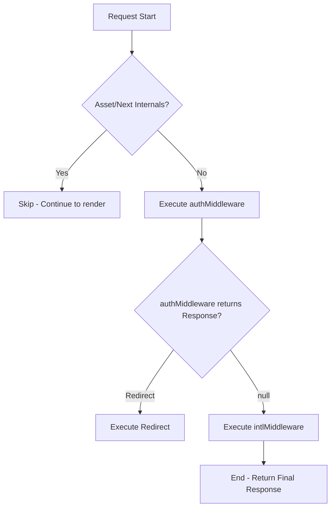
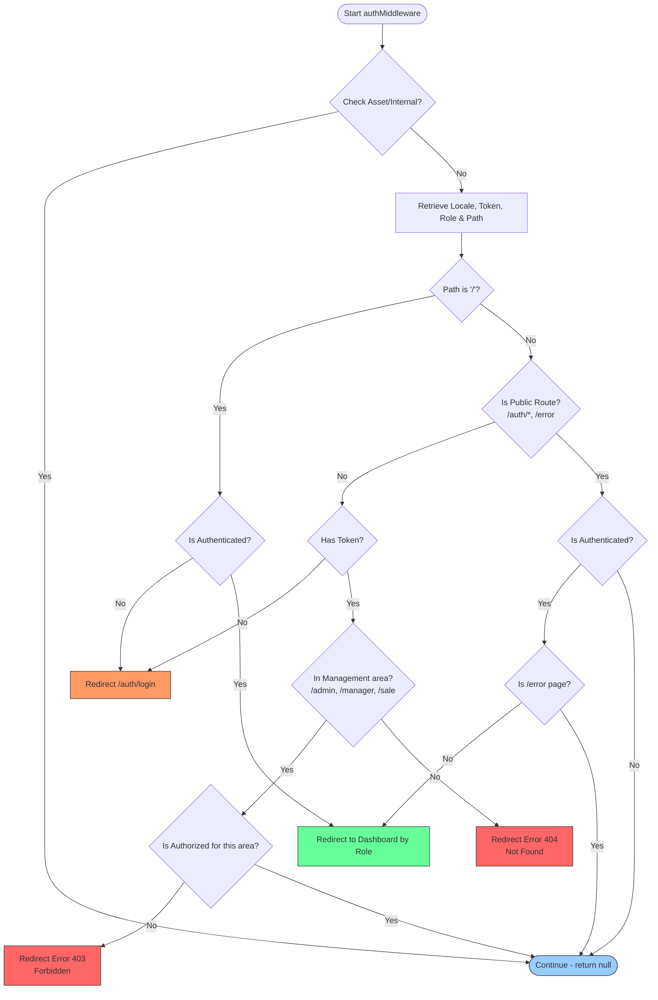

# Auth Middleware Logic Flow

This document describes the middleware processing flow for the Mini CRM project, including Internationalization (i18n), Authentication, and Role-Based Access Control (RBAC).

## 1. Overall Processing Flow (Main Middleware)

The project uses `middleware.ts` as the primary entry point, combining `next-intl` and a custom `authMiddleware`.

## 2. Detailed Auth & RBAC Logic

The flowchart below illustrates the specific validation steps within `middleware/auth.ts`:

## 3. Access Control matrix

| Role | Authorized Prefixes | Primary Dashboard |
| :--- | :--- | :--- |
| **Admin** | `/admin/*`, `/manager/*`, `/sale/*` | 
| **Manager** | `/manager/*`, `/sale/*` | 
| **Sale** | `/sale/*` | 

## 4. Error Handling

-   **403 Forbidden**: Triggered when an authenticated user attempts to access a prefix that their role does not have permission for (e.g., a Sale user trying to access `/admin`).
-   **404 Not Found**: Triggered when the requested path is neither a Public route nor starts with a recognized management prefix (`/admin`, `/manager`, `/sale`).
